# wonderland-framework-example

## WebXR examples
* https://heyVR.io

## Intro to the Wonderland Editor
* Install Wonderland Engine from [here](https://wonderlandengine.com/downloads/)
* Create new project with `VR` template

* Open any object from `Scene Outline` tree and press `F` key for centering on it.

* Press `Right Mouse` button and drug for rotating scene.
* Press `Center Mouse` button and drug for rotating around selected object.
* Rotate `Mouse Wheel` for changing zoom
* Press `Shift + Center Mouse` and drug for moving scene.
* Press `W` or `S` + `Right Mouse` button and drug for changing zoom.
* Press `A` or `D` + `Right Mouse` button and drug for moving scene.
* Press `Q` or `E` + `Right Mouse` button and drug for moving scene.
* Press `1`, `3`, `7` numpad button for changing scene view.
* Select object with `Left Mouse` then press `Transition Gismo` panel button (or `G` key) and move object
* Select object then press `Rotation Gizmo` panel button (or `R` key) and rotate object.
* Select object then press `Scaling Gizmo` panel button (or `S` key) and scale object.

## Add GLTF scene
* Remove Panel, Cube, Cone and Sphere objects
* Set FloorPlane as inactive mesh
* Copy GLB file to model folder
* Drag-and-drop GLB file to scene

## Debug Quest VR Browser Content
1. Enable USB Debugging on Oculus Quest
    1.   `adb devices`
         should show list of attached devices
    1. `scrcpy -c 1096:1240:174:150` should show screen content
1. Enable Wi-Fi Debugging
    1. Determine the IP address for the device
       `adb shell ip route`
    1. Set adb TCP port `adb tcpip 5555`
    1. Connect device to the debugger `adb connect <ip-address>:5555` or `adb connect $(adb shell ip route | awk 'NR==1{print $9}')`
    3. To stop using the Wi-Fi connection, issue the following ADB command from the OS shell:
       `adb disconnect`
1. Start a Remote Debugging Session with Chrome Developer Tools
    1. On the device, browse to your site in Oculus Browser
    1. Launch Google Chrome on PC.
    1. Navigate to `chrome://inspect/#devices`
    1. Find your device, which will be followed by a set of Oculus browser tabs currently open on the device.
    1. Click **inspect** link under to the Oculus Browser tab you wish to debug.

## Add action to a 3D object

1. Create new JavaScript file for component action
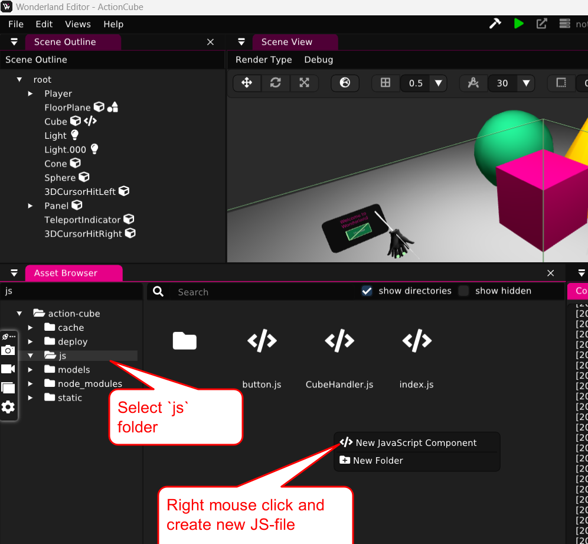
2. Open JS-file with any editor and configure `init`, `start` and `update` functions
   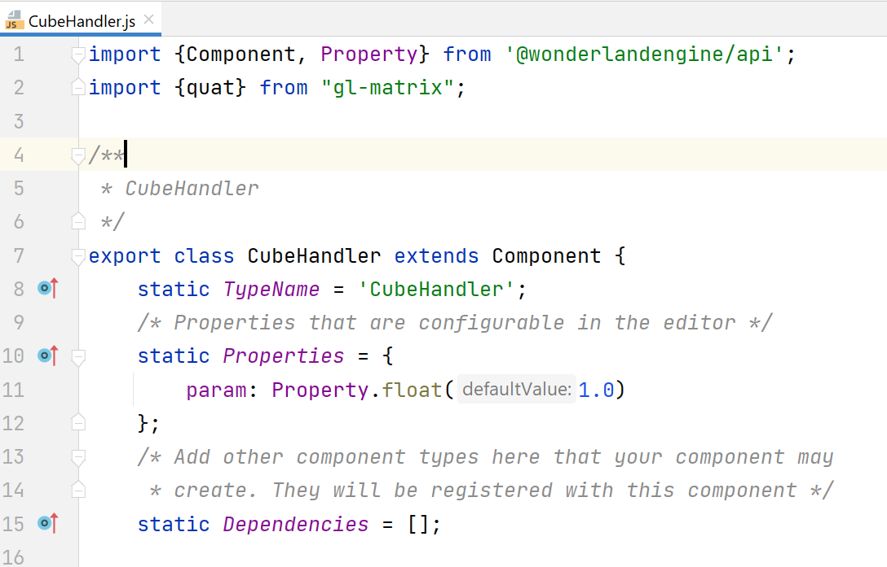
   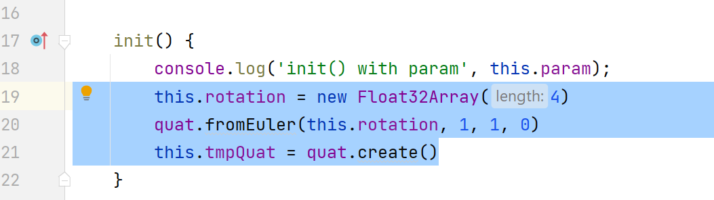
   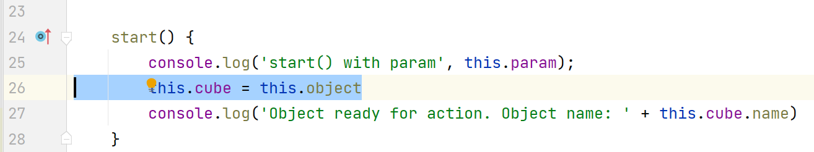
   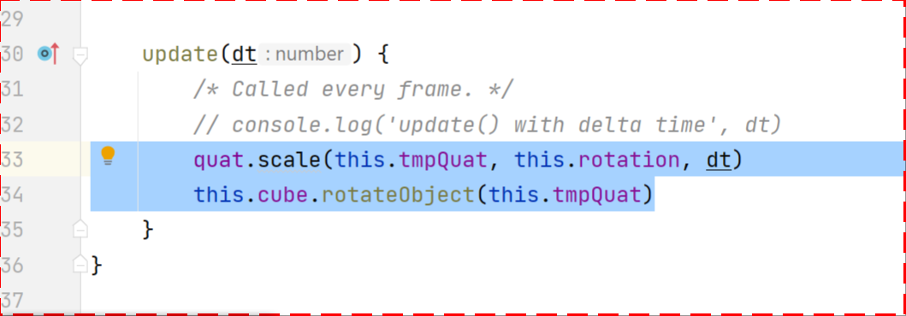
3. Link component to JavaScript file
   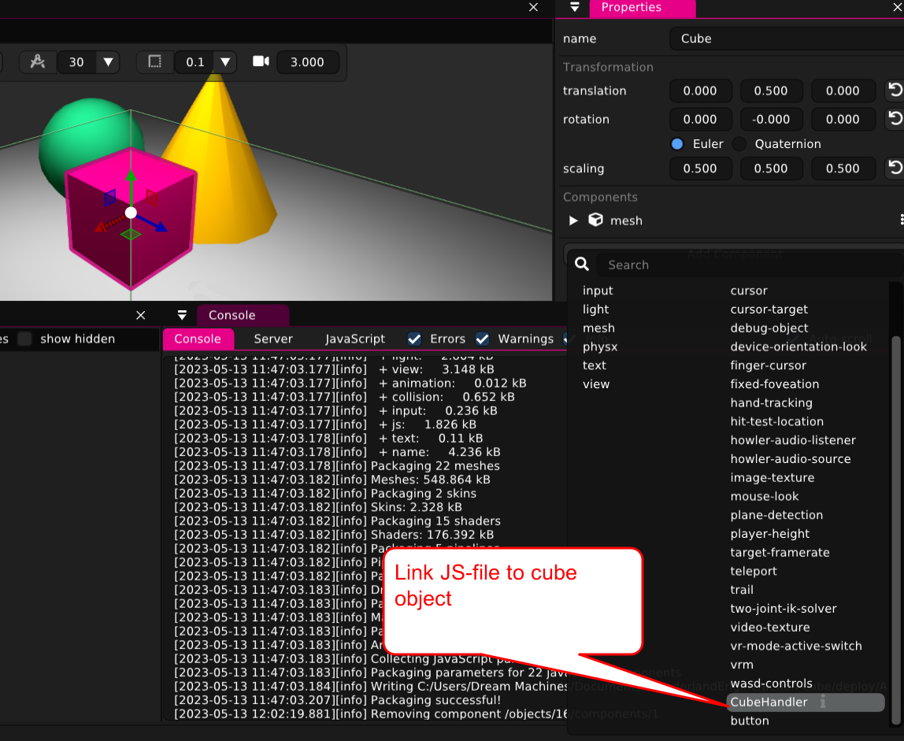
4. Configure test server with https protocol
   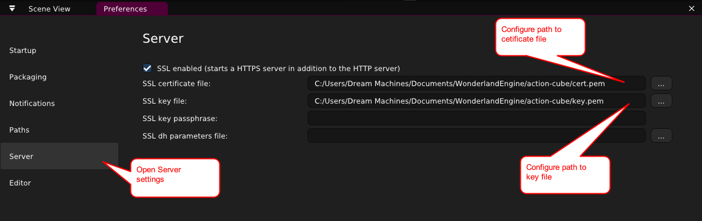
5. Investigate library https://glmatrix.net/docs/module-quat.html

## Configure throwing cube into player

1. Add link to `vec` sub library
   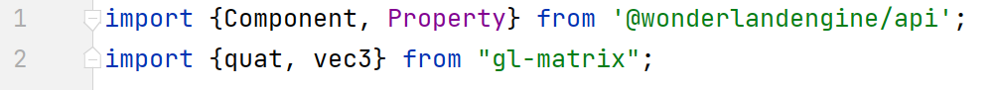
2. Add properties section in cube handle
   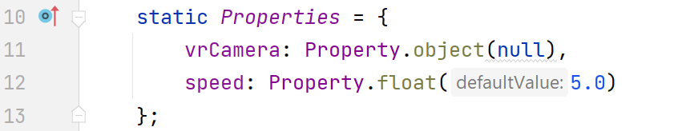
3. Configure handler properties in `Wonderland` application:
   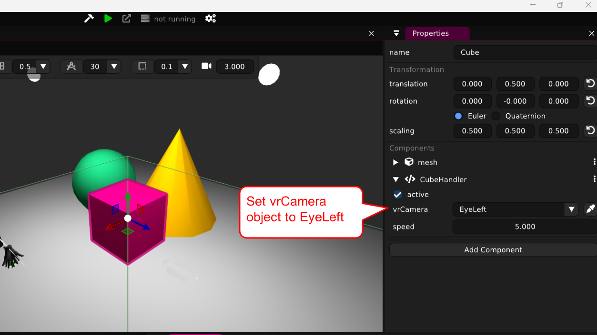
4. Add two vectors for working with camera and cube
   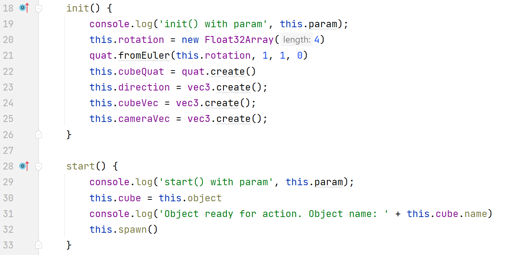
5. Add flying cube to `update` function
   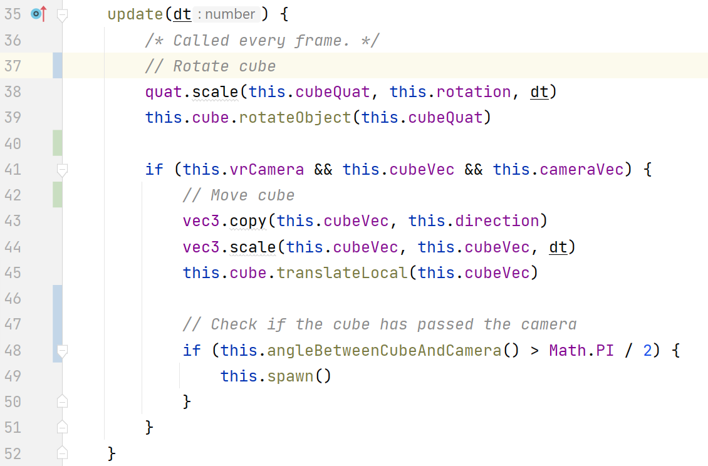
6. Add auxiliary function for angle.
   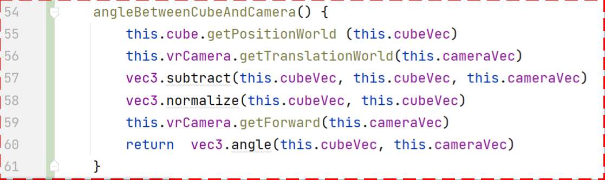
7. Add auxiliary function for cube initial position.
   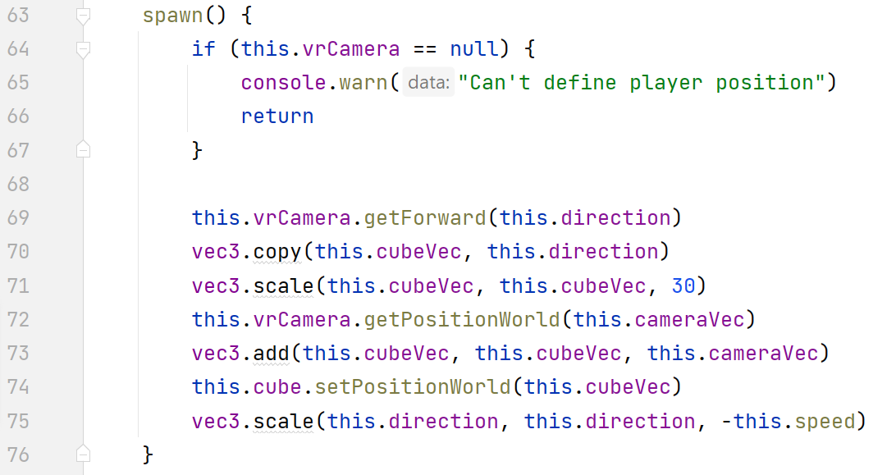

## Challenge: Count hit and miss actions

Initial code
```javascript
import {Component, Property} from '@wonderlandengine/api';
import {quat, vec3} from "gl-matrix";

/**
 * CubeHandler
 */
export class CubeHandler extends Component {
   static TypeName = 'CubeHandler';
   /* Properties that are configurable in the editor */
   static Properties = {
      vrCamera: Property.object(null),
      speed: Property.float(5.0),
      initialDistance: Property.float(30),
      countSpawnText: Property.object(),
      countHitText: Property.object(),
      countMissText: Property.object()
   };
   /* Add other component types here that your component may
    * create. They will be registered with this component */
   static Dependencies = [];

   init() {
      console.log('init() with param', this.param);
      this.rotation = new Float32Array(4)
      quat.fromEuler(this.rotation, 1, 1, 0)
      this.cubeQuat = quat.create()
      this.direction = vec3.create()
      this.cubeVec = vec3.create()
      this.cameraVec = vec3.create()
      this.count = 0
   }

   start() {
      console.log('start() with param', this.param);
      if (this.countSpawnText) {
         this.spawnValue = this.countSpawnText.getComponent('text')
      }
      if (this.countHitText) {
         this.hitValue = this.countHitText.getComponent('text')
      }
      if (this.countMissText) {
         this.missValue = this.countMissText.getComponent('text')
      }
      this.cube = this.object
      console.log('Object ready for action. Object name: ' + this.cube.name)
      this.spawn()
   }

   update(dt) {
      /* Called every frame. */
      // Rotate cube
      quat.scale(this.cubeQuat, this.rotation, dt)
      this.cube.rotateObject(this.cubeQuat)

      if (this.vrCamera && this.cubeVec && this.cameraVec) {
         // Move cube
         vec3.copy(this.cubeVec, this.direction)
         vec3.scale(this.cubeVec, this.cubeVec, dt)
         this.cube.translateLocal(this.cubeVec)

         // Check if the cube has passed the camera
         if (this.angleBetweenCubeAndCamera() > Math.PI / 2) {
            // TODO remove, for debug only
            const dist = this.distanceBetweenCubeAndCamera()
            this.updateHitCount(dist.toFixed(2))

            this.spawn()
         }
      }
   }

   angleBetweenCubeAndCamera() {
      this.cube.getPositionWorld (this.cubeVec)
      this.vrCamera.getTranslationWorld(this.cameraVec)
      vec3.subtract(this.cubeVec, this.cubeVec, this.cameraVec)
      vec3.normalize(this.cubeVec, this.cubeVec)
      this.vrCamera.getForward(this.cameraVec)
      return  vec3.angle(this.cubeVec, this.cameraVec)
   }

   distanceBetweenCubeAndCamera() {
      this.cube.getPositionWorld (this.cubeVec)
      this.vrCamera.getPositionWorld(this.cameraVec)

      return vec3.distance(this.cubeVec, this.cameraVec);
   }

   spawn() {
      if (this.vrCamera == null) {
         console.warn("Can't define player position")
         return
      }

      this.vrCamera.getForward(this.direction)
      vec3.copy(this.cubeVec, this.direction)
      vec3.scale(this.cubeVec, this.cubeVec, this.initialDistance)
      this.vrCamera.getPositionWorld(this.cameraVec)
      vec3.add(this.cubeVec, this.cubeVec, this.cameraVec)
      this.cube.setPositionWorld(this.cubeVec)
      vec3.scale(this.direction, this.direction, -this.speed)
      this.updateCount(++this.count)
   }

   updateCount(value) {
      if (!this.spawnValue) return

      this.spawnValue.text = value.toString()
      console.log(`updated count value to: ${value}`)
   }

   updateHitCount(value) {
      if (!this.hitValue) return

      this.hitValue.text = value.toString()
      console.log(`updated hit value to: ${value}`)
   }

   updateMissCount(value) {
      if (!this.missValue) return

      this.missValue.text = value.toString()
      console.log(`updated miss value to: ${value}`)
   }
}
```

## Tutorials

https://wonderlandengine.com/tutorials/