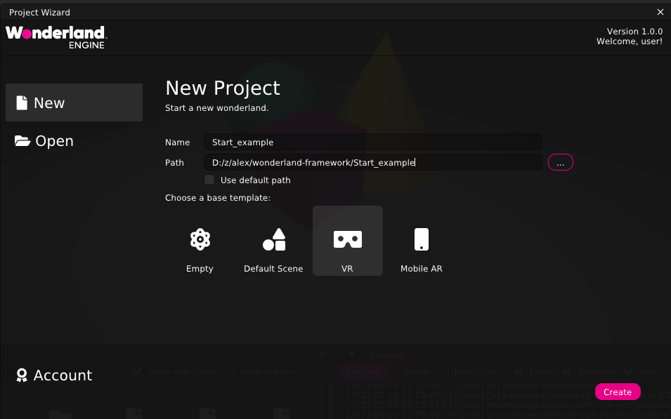
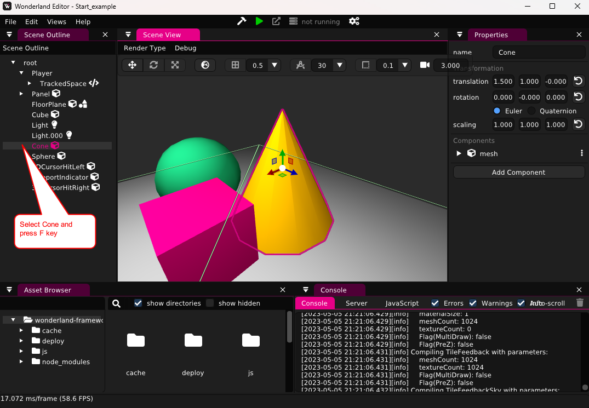

# wonderland-framework-example

## WebXR examples
* https://heyVR.io

## Intro to the Wonderland Editor
* Install Wonderland Engine from [here](https://wonderlandengine.com/downloads/)
* Create new project with `VR` template

* Open any object from `Scene Outline` tree and press `F` key for centering on it.

* Press `Right Mouse` button and drug for rotating scene.
* Press `Center Mouse` button and drug for rotating around selected object.
* Rotate `Mouse Wheel` for changing zoom
* Press `Shift + Center Mouse` and drug for moving scene.
* Press `W` or `S` + `Right Mouse` button and drug for changing zoom.
* Press `A` or `D` + `Right Mouse` button and drug for moving scene.
* Press `Q` or `E` + `Right Mouse` button and drug for moving scene.
* Press `1`, `3`, `7` numpad button for changing scene view.
* Select object with `Left Mouse` then press `Transition Gismo` panel button (or `G` key) and move object
* Select object then press `Rotation Gizmo` panel button (or `R` key) and rotate object.
* Select object then press `Scaling Gizmo` panel button (or `S` key) and scale object.

## Add GLTF scene
* Remove Panel, Cube, Cone and Sphere objects
* Set FloorPlane as inactive mesh
* Copy GLB file to model folder
* Drag-and-drop GLB file to scene

## Debug Quest VR Browser Content
1. Enable USB Debugging on Oculus Quest
    1.   `adb devices`
         should show list of attached devices
    1. `scrcpy -c 1096:1240:174:150` should show screen content
1. Enable Wi-Fi Debugging
    1. Determine the IP address for the device
       `adb shell ip route`
    1. Set adb TCP port `adb tcpip 5555`
    1. Connect device to the debugger `adb connect <ip-address>:5555` or `adb connect $(adb shell ip route | awk 'NR==1{print $9}')`
    3. To stop using the Wi-Fi connection, issue the following ADB command from the OS shell:
       `adb disconnect`
1. Start a Remote Debugging Session with Chrome Developer Tools
    1. On the device, browse to your site in Oculus Browser
    1. Launch Google Chrome on PC.
    1. Navigate to `chrome://inspect/#devices`
    1. Find your device, which will be followed by a set of Oculus browser tabs currently open on the device.
    1. Click **inspect** link under to the Oculus Browser tab you wish to debug.
